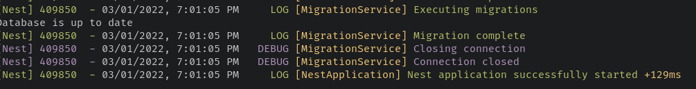

[](https://github.com/marianozunino/morpheus/actions/workflows/build_deploy.yml)
[](https://opensource.org/licenses/MIT)
[](https://coveralls.io/github/marianozunino/morpheus)

[](https://npmjs.com/package/morpheus4j)
<a href="http://nestjs.com/" target="blank"></a>

### Table of Contents

- [⚠️ Important/Notice](#---important-notice)
- [Morpheus](#morpheus)
    + [About](#about)
- [Installation](#installation)
- [Usage](#usage)
  * [Initial Configuration](#initial-configuration)
  * [Create Migrations](#create-migrations)
  * [Run Migrations](#run-migrations)
- [NestJs Integration <a href="http://nestjs.com/" target="blank"></a>](#nestjs-integration)
  * [Module Registration](#module-registration)
  * [Do you have multiple instances that you want to run migrations on?](#do-you-have-multiple-instances-that-you-want-to-run-migrations-on-)
- [How it works](#how-it-works)
  * [How does neo4j keep track of the migrations?](#how-does-neo4j-keep-track-of-the-migrations-)

# ⚠️ Important/Notice

- **Attention:** Version 2.x had a [bug](https://github.com/marianozunino/morpheus/issues/25) where the migrations versions where not being compared correctly. Please, don't use that version.

# Morpheus

### About
Morpheus is a database migration tool for Neo4j written in Typescript.

> Morpheus is a modern, open-source, database migration tool for [Neo4j](http://neo4j.com).
> It is designed to be a simple, intuitive tool for database migrations.
> It is inspired by [Michael Simons tool for Java](https://github.com/michael-simons/neo4j-migrations).

This project has been tested with

> - Neo4j 4.4.4
> - Neo4j 5.x
> - Neo4j Aura

# Installation

Install the latest version of Morpheus:

```sh
npm install morpheus4j
```

Add a script to your project's `package.json` file:

```json
"scripts": {
  "morpheus": "morpheus"
}
```

# Usage

## Initial Configuration

To run migrations, first you need to configure Morpheus. To do so, create a `.morpheus.json` file in your project root directory.

> Or, you can use the `init` command:

```sh
npm run morpheus init
```

If you don't want to use a morpheus.json file, you can also use ENV variables as follows:

```env
# This refers to the scheme used to connect to the database. https://neo4j.com/docs/upgrade-migration-guide/current/version-4/migration/drivers/new-uri-schemes/
MORPHEUS_SCHEME=neo4j

# This refers to the host of the database, don't include the port nor the scheme.
MORPHEUS_HOST=localhost

# This refers to the port of the database.
MORPHEUS_PORT=7687

# This refers to the username of the database.
MORPHEUS_USERNAME=neo4j

# This refers to the password of the database.
MORPHEUS_PASSWORD=neo4j

# This refers to the name of the database.
MORPHEUS_DATABASE=neo4j # default value

# This refers to the path where the migrations are located.
MORPHEUS_MIGRATIONS_PATH=neo4j/migrations # default value
```

## Create Migrations

You can create/generate migrations using the `morpheus create` command or create the files manually.

For the first, just issue the command:

```sh
npm run morpheus create <migration_name>
```

Migrations will be created under the `neo4j/migrations` directory. Each migration will be a `Cypher` file following the format `V<sem_ver>__<migration_name>.cypher`.

If you want to create/add the migration manually make sure to follow the naming convention as stated in [Michael's tool documentation](https://michael-simons.github.io/neo4j-migrations/current/#concepts_naming-conventions).

## Run Migrations

You can run migrations by running the following command:

```sh
npm run morpheus migrate
```

This will run all migrations in the `neo4j/migrations` directory.

# NestJs Integration <a href="http://nestjs.com/" target="blank"></a>

You can use Morpheus with the [NestJs](https://nestjs.com) framework.

> Migrations will be run automatically when the application is
> [started](https://docs.nestjs.com/fundamentals/lifecycle-events#lifecycle-events-1) > 

The biggest difference is that you don't need to create a `.morpheus.json` file and you can use any name for the ENV variables.

You can instantiate the module using the `forRoot` or `forRootAsync` methods.

### Module registration

```ts
import { Module } from '@nestjs/common';
import { ConfigService, ConfigModule } from '@nestjs/config';
import { MorpheusModule } from 'morpheus4j';

@Module({
  imports: [
    // Sync register
    MorpheusModule.register({
      scheme: 'bolt',
      host: 'localhost',
      port: 7687,
      username: 'neo4j',
      password: 'password',
      database: 'neo4j',
      migrationsPath: './neo4j/migrations', // default value
    }),
    // Async register
    MorpheusModule.registerAsync({
      imports: [ConfigModule],
      useFactory: (configService: ConfigService) => ({
        scheme: configService.get('MORPHEUS_SCHEME'),
        host: configService.get('MORPHEUS_HOST'),
        port: configService.get('MORPHEUS_PORT'),
        username: configService.get('MORPHEUS_USERNAME'),
        password: configService.get('MORPHEUS_PASSWORD'),
        database: configService.get('MORPHEUS_DATABASE'),
        migrationsPath: './neo4j/migrations', // default value
      }),
      inject: [ConfigService],
    }),
  ],
})
export class AppModule {}
```

#### Do you have multiple instances that you want to run migrations on?

You can check out this issue [Multiple instances](https://github.com/marianozunino/morpheus/issues/30) for more information.

# How it works

The approach is simple. Morpheus will read all migrations in the `neo4j/migrations` directory and execute them in order.

For each migration, Morpheus will create a transaction and execute the migration. Thus a migration may contain multiple Cypher statements (**each statement must end with `;`**).

Once a migration file is executed, Morpheus will keep track of the migration and will not execute em again.

Existing migration files that have already been executed **can not** be modified since they are stored in a database with their corresponding checksum (crc32).

If you want to revert a migration, create a new migration and revert the changes.

## How does neo4j keep track of the migrations?

You can take a look at schema and explanation on [Michael's README](https://michael-simons.github.io/neo4j-migrations/2.2.0/#concepts_chain) there's a neat graph that shows the migration chain.
