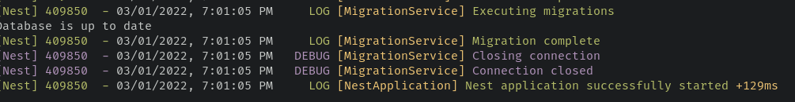

[](https://github.com/marianozunino/morpheus/actions/workflows/build_deploy.yml)
[](https://opensource.org/licenses/MIT)
[](https://coveralls.io/github/marianozunino/morpheus)

[](https://npmjs.com/package/morpheus4j)
<a href="http://nestjs.com/" target="blank"></a>


<!-- TOC start (generated with https://github.com/derlin/bitdowntoc) -->

- [Morpheus](#morpheus)
   * [About](#about)
   * [How it works](#how-it-works)
   * [How does neo4j keep track of the migrations?](#how-does-neo4j-keep-track-of-the-migrations)
   * [Morpheus CLI](#morpheus-cli)
      + [Installation 📥](#installation)
      + [Usage](#usage)
      + [Initial Configuration](#initial-configuration)
      + [Create Migrations](#create-migrations)
      + [Run Migrations](#run-migrations)
   * [Morpheus NestJs Module <a href="http://nestjs.com/" target="blank"></a>](#morpheus-nestjs-module)
      + [Installation 📥](#installation-1)
      + [Usage](#usage-1)
      + [Run migrations on multiple instances](#run-migrations-on-multiple-instances)
- [Contributing Guidelines](#contributing-guidelines)
   * [Getting Started 🛠️](#getting-started-)
      + [Setting Up Your Environment 🌐](#setting-up-your-environment-)
   * [Making Changes 🚧](#making-changes-)

<!-- TOC end -->

<!-- TOC --><a name="morpheus"></a>
# Morpheus

<!-- TOC --><a name="about"></a>
## About
Morpheus is a database migration tool for Neo4j written in Typescript.

> Morpheus is a modern, open-source, database migration tool for [Neo4j](http://neo4j.com).
> It is designed to be a simple, intuitive tool for database migrations.
> It is inspired by [Michael Simons tool for Java](https://github.com/michael-simons/neo4j-migrations).

This project has been tested with

> - Neo4j 4.4.4
> - Neo4j 5.x
> - Neo4j Aura


<!-- TOC --><a name="how-it-works"></a>
## How it works

The approach is simple. Morpheus will read all migrations in the `neo4j/migrations` directory and execute them in order.

For each migration, Morpheus will create a transaction and execute the migration. Thus a migration may contain multiple Cypher statements (**each statement must end with `;`**).

Once a migration file is executed, Morpheus will keep track of the migration and will not execute em again.

Existing migration files that have already been executed **can not** be modified since they are stored in a database with their corresponding checksum (crc32).

If you want to revert a migration, create a new migration and revert the changes.

<!-- TOC --><a name="how-does-neo4j-keep-track-of-the-migrations"></a>
## How does neo4j keep track of the migrations?

You can take a look at schema and explanation on [Michael's README](https://michael-simons.github.io/neo4j-migrations/2.2.0/#concepts_chain) there's a neat graph that shows the migration chain.

This repo uses [changesets](https://github.com/changesets/changesets) to
make releasing updates easier. For you, the contributor, this means you
should run `npm run changeset` when you've got your changes ready. For
more details, see this short document on [adding a changeset](https://github.com/changesets/changesets/blob/main/docs/adding-a-changeset.md#i-am-in-a-multi-package-repository-a-mono-repo).

<!-- TOC --><a name="morpheus-cli"></a>
## Morpheus CLI

<!-- TOC --><a name="installation"></a>
### Installation 📥

Install the latest version of Morpheus:

```sh
npm install @morpheus4j/cli
```

Add a script to your project's `package.json` file:

```json
"scripts": {
  "morpheus": "morpheus"
}
```

<!-- TOC --><a name="usage"></a>
### Usage

<!-- TOC --><a name="initial-configuration"></a>
### Initial Configuration

To run migrations, first you need to configure Morpheus. To do so, create a `.morpheus.json` file in your project root directory.

> Or, you can use the `init` command:

```sh
npm run morpheus init
```

If you don't want to use a morpheus.json file, you can also use ENV variables as follows:

```env
# This refers to the scheme used to connect to the database. https://neo4j.com/docs/upgrade-migration-guide/current/version-4/migration/drivers/new-uri-schemes/
MORPHEUS_SCHEME=neo4j

# This refers to the host of the database, don't include the port nor the scheme.
MORPHEUS_HOST=localhost

# This refers to the port of the database.
MORPHEUS_PORT=7687

# This refers to the username of the database.
MORPHEUS_USERNAME=neo4j

# This refers to the password of the database.
MORPHEUS_PASSWORD=neo4j

# This refers to the name of the database.
MORPHEUS_DATABASE=neo4j # default value

# This refers to the path where the migrations are located.
MORPHEUS_MIGRATIONS_PATH=neo4j/migrations # default value
```

<!-- TOC --><a name="create-migrations"></a>
### Create Migrations

You can create/generate migrations using the `morpheus create` command or create the files manually.

For the first, just issue the command:

```sh
npm run morpheus create <migration_name>
```

Migrations will be created under the `neo4j/migrations` directory. Each migration will be a `Cypher` file following the format `V<sem_ver>__<migration_name>.cypher`.

If you want to create/add the migration manually make sure to follow the naming convention as stated in [Michael's tool documentation](https://michael-simons.github.io/neo4j-migrations/current/#concepts_naming-conventions).

<!-- TOC --><a name="run-migrations"></a>
### Run Migrations

You can run migrations by running the following command:

```sh
npm run morpheus migrate
```

This will run all migrations in the `neo4j/migrations` directory.

<!-- TOC --><a name="morpheus-nestjs-module"></a>
## Morpheus NestJs Module <a href="http://nestjs.com/" target="blank"></a>

You can use Morpheus with the [NestJs](https://nestjs.com) framework.

> Migrations will be run automatically when the application is
> [started](https://docs.nestjs.com/fundamentals/lifecycle-events#lifecycle-events-1) > 

The biggest difference is that you don't need to create a `.morpheus.json` file and you can use any name for the ENV variables.

<!-- TOC --><a name="installation-1"></a>
### Installation 📥

Install the latest version of Morpheus:

```sh
npm install @morpheus4j/nestjs
```

<!-- TOC --><a name="usage-1"></a>
### Usage

You can instantiate the module using the `forRoot` or `forRootAsync` methods.

```ts
import { Module } from '@nestjs/common';
import { ConfigService, ConfigModule } from '@nestjs/config';
import { MorpheusModule } from 'morpheus4j';

@Module({
  imports: [
    // Sync register
    MorpheusModule.register({
      scheme: 'bolt',
      host: 'localhost',
      port: 7687,
      username: 'neo4j',
      password: 'password',
      database: 'neo4j',
      migrationsPath: './neo4j/migrations', // default value
    }),
    // Async register
    MorpheusModule.registerAsync({
      imports: [ConfigModule],
      useFactory: (configService: ConfigService) => ({
        scheme: configService.get('MORPHEUS_SCHEME'),
        host: configService.get('MORPHEUS_HOST'),
        port: configService.get('MORPHEUS_PORT'),
        username: configService.get('MORPHEUS_USERNAME'),
        password: configService.get('MORPHEUS_PASSWORD'),
        database: configService.get('MORPHEUS_DATABASE'),
        migrationsPath: './neo4j/migrations', // default value
      }),
      inject: [ConfigService],
    }),
  ],
})
export class AppModule {}
```

<!-- TOC --><a name="run-migrations-on-multiple-instances"></a>
### Run migrations on multiple instances

You can check out this issue [Multiple instances](https://github.com/marianozunino/morpheus/issues/30) for more information.

<!-- TOC --><a name="contributing-guidelines"></a>
# Contributing Guidelines

Welcome to the contribution guide for our project! We appreciate your interest in improving and extending this repository. To streamline the release process, we utilize [changesets](https://github.com/changesets/changesets).

<!-- TOC --><a name="getting-started-"></a>
## Getting Started 🛠️

Before you start contributing, please make sure you have [Node.js](https://nodejs.org/) and [pnpm](https://pnpm.io/) installed.

<!-- TOC --><a name="setting-up-your-environment-"></a>
### Setting Up Your Environment 🌐

1. Clone this repository to your local machine.

   ```bash
   git clone https://github.com/marianozunino/morpheus
   ```

2. Install project dependencies.

   ```bash
   pnpm install
   ```

<!-- TOC --><a name="making-changes-"></a>
## Making Changes 🚧

Once you've identified the changes you'd like to make, follow these steps:

1. Run the following command when your changes are ready:

   ```bash
   pnpm changeset
   ```

   This command will prompt you to describe your changes and will create a changeset file.

   For additional details on adding a changeset, refer to [this short document on adding a changeset](https://github.com/changesets/changesets/blob/main/docs/adding-a-changeset.md#i-am-in-a-multi-package-repository-a-mono-repo).

2. Commit your changes, including the generated changeset files.

   ```bash
   git add .
   git commit -m "Your meaningful commit message"
   ```

3. Push your changes to your forked repository.

   ```bash
   git push origin your-branch
   ```

4. Create a pull request against the master branch.

Thank you for contributing! Your efforts help make this project even better. 🙌

